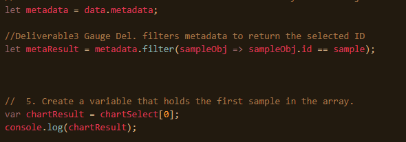
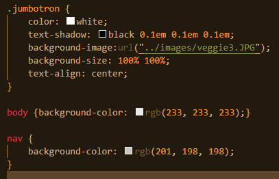
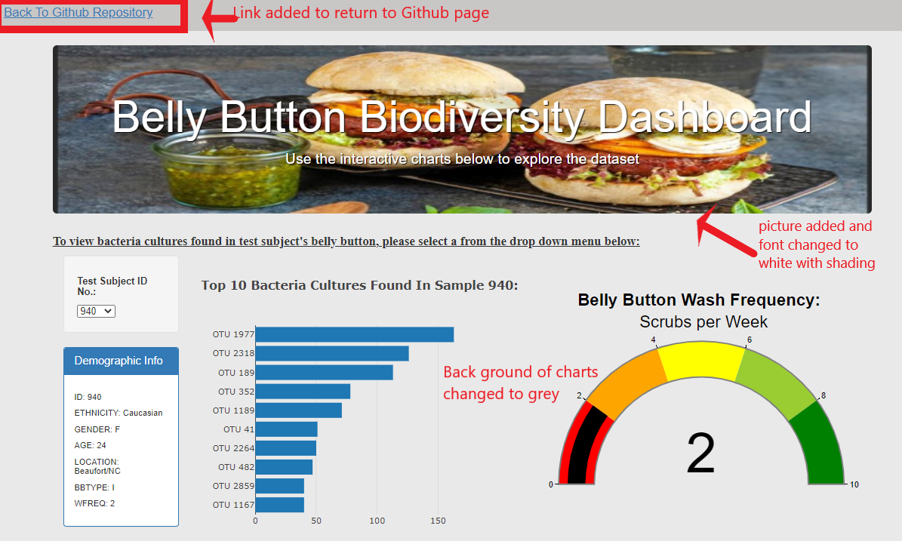

# BellyButton
Mod12

[Link To Deployed WebPage](https://cthompsonlbi.github.io/BellyButton)

## Overview

Assist Roza with the partically completed dashboard by adding visualizations to compliment her demographic panel.  The visualizations will expand upon the demographic panel by providing visuals to highlight the type of bacteria found, how much bacteria is found and the wash frequency of each individual represented in the applicable data set.  The end goal is to find individuals with a particular species of bacteria that will assist in the production of synthetic beef.

### Purpose

The purpose of this exercise is to help reinforce lessons learned through Module 12 and earlier with Javascript, HTML, CSS, Plotly and Bootstrap and apply them be creating and then refining a dashboard.

### Delivery 1

Code is created to handle arrays when a sample is selected from a dropdown menu.
A function buildCharts() is created through code to create a trace object that will contain the following information to be used for plot creation through Plotly:

  * The y values are the otu_ids in descending order
  * The x values are the sample_values in descending order
  * The hover text is the otu_labels in descending order.
  * Assign the chart type as "bar"
  * Assign the bar chart as a "h" for horizontal

The onoce completed I created code to handle the layout array in the buildCharts() function.  This layout array will do the following:
   * Creates a title for the chart
   * Hides the legend
   * Reverse the chart to display large samples at the top and descends to the bottom for the smaller samples
   * Changed the plot background color to a light grey
   * Changed the paper background color to a light grey
  
When the dashboard is first opened in a browser, ID 940’s data is preloaded in the dashboard, and the bar chart has the following:
  * The top 10 sample_values are sorted in descending order
  * The top 10 sample_values as values
  * The otu_ids as the labels
  
### Delivery 2

For this deliverable, I leveraged a large portion of the code created for the first deliverable to create the bubble chart on this dashboard.
The code created in the buildCharts() function to handle the trace object information of the bubble chart are as follows:
  * Set the otu_ids as the x-axis
  * Set the sample_values as the y-axis
  * Set the otu_labels as the hover-text values
  * Set the sample_values as the marker size
  * Set the otu_ids as the marker colors in the bubble chart.
  * Colorscale was set to "JET"

Code has been created in the buildCharts() function to handle the layout object of the bubble chart.The following has been added to the layout variable:
  * Code to create a title
  * Code created to label the x-axis
  * Code created to label the y-axis
  * Text appears when hovering over the bubble.
  * plot background color and paper background color set to light gray.

### Delivery 3

Delivery 3 was a bit more challenging as much of what was done for deliverables one and two could not be reused for this deliverable.  The data required to create this plot had to be accessed through the metadata and not the samples array as had been done for the two previous deliverables.  A metadata variable had to be created to store the data from the metadata.  Then a filter object had to be utilized to filter upon the data that was selected from the drop down menu. 

To create the gauge chart we needed to access the wash frequency of the subjects and plot that data.  Once I created the code to obtaing the wash frequency of the selected subject, I did the following to create the gauge chart:

  * Created a title bar using title:{text:}
  * Pulled in the wash frequency values as wfreq
  * Assinged the gauge data type as "indicator"
  * Assigned the mode as "gauge+number"
  * Layed out the gauge to color coded intervals
  * Used both a numeric value and gauge length to indicate frequency
  * Set the gauge margins and positions within the HTML document
  * set the plot and paper background to a light gray color

### Delivery 4

As you can see from the code snippet above I used the css style sheet for some of the customizations of the webpage listed below:

* Used CSS to add an image through my Style.CSS file
* Changed Font Color in Jumbotron using CSS Style.CSS file
* Provide code for shading is Style.CSS for better visibility of text overlayed on an image
* Used HTML tags in the Index file and Charts.JS file to Bold the Titles
* Change the background color of Index.html and Charts.JS to grey to reduce eyestrain from the previously white background page
* Added NavBar through HTML that provides a quicklink back to my Github page
* Used CSS styling to darken the NavBar slightly to help guide the users eyes
* Added Paragraph Tag Below Jumbotron to provide use instructions to the user

